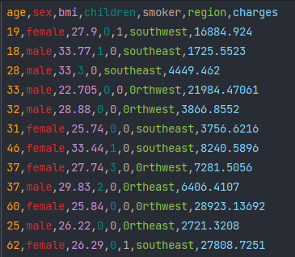
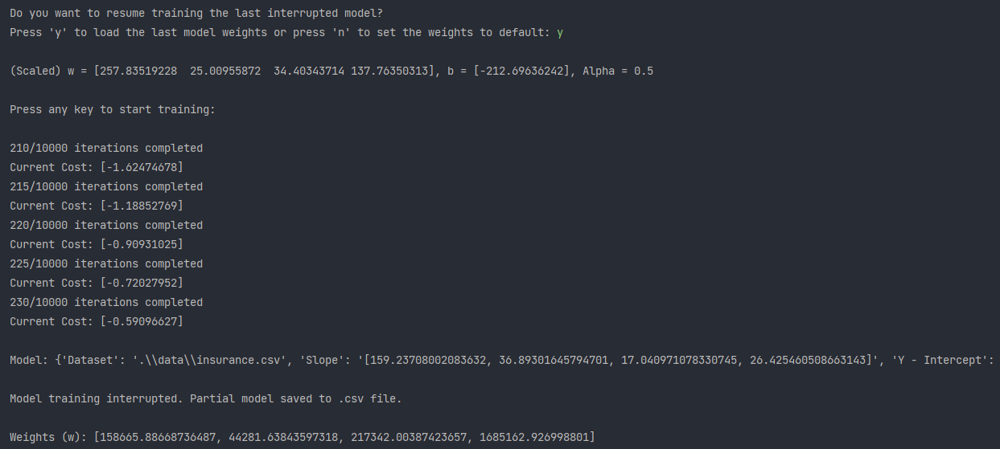
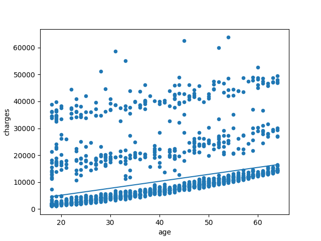
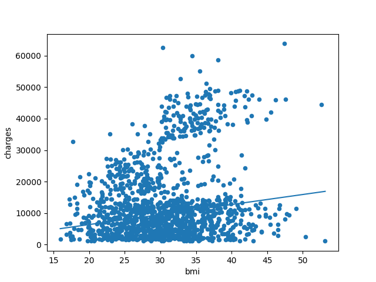

# Multiple-Linear-Regression

Basic Machine Learning Predictor using Multiple Linear Regression.
1. Supply a vertical dataset. 
2. Use the 'LinearRegression' class to train your own model on the dataset. 
3. Run the trained model using 'predict_with_model()' function and predict the target. 
 

### Todo:

Update documentation.

## Screenshots

 

 

 
