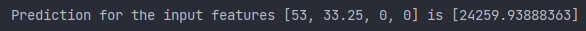
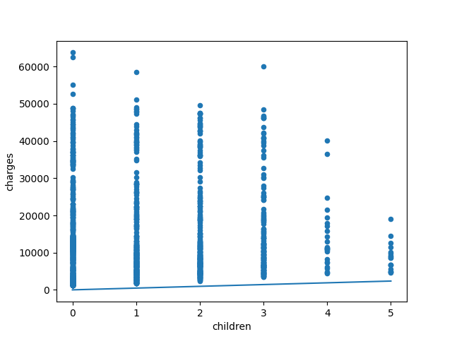
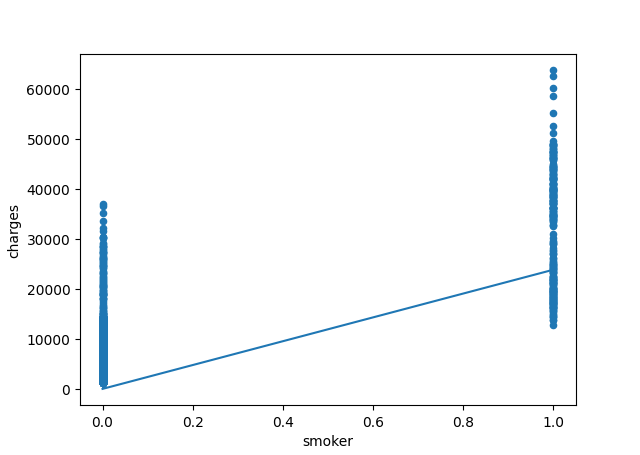

# Multiple-Linear-Regression

Implementation of Multiple Linear Regression. 
Use it to train your own model on any vertical dataset. 
Predict the values by supplying the necessary parameters. 
 

### Todo:

Update documentation,

## Screenshots

 

 

 

 

 

 
